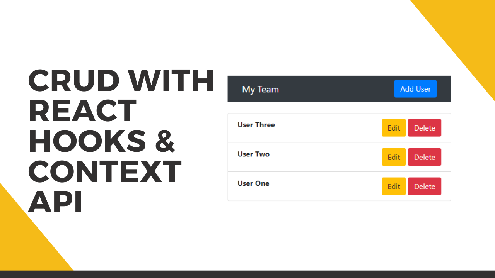

# CRUD react app with context api
Create CRUD application using react hooks and context api.

## screenshot

## Links
Reactstrap : https://reactstrap.github.io/

### Video Tutorial
[Part 1](https://youtu.be/5KZ1XBcSaH4)
[Part 2](https://youtu.be/_1QtdnqHq8I)